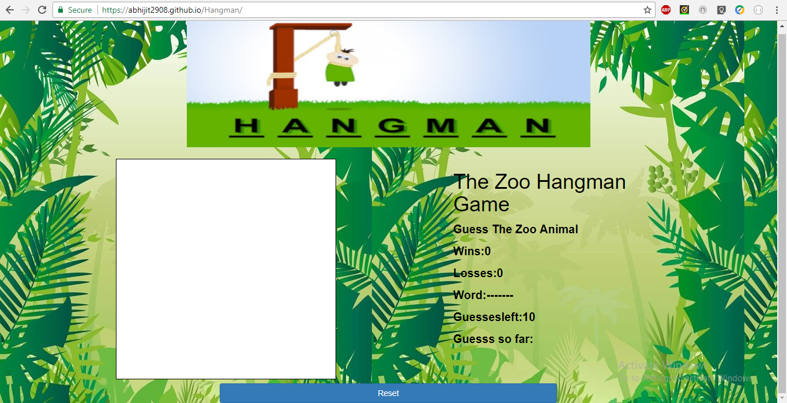
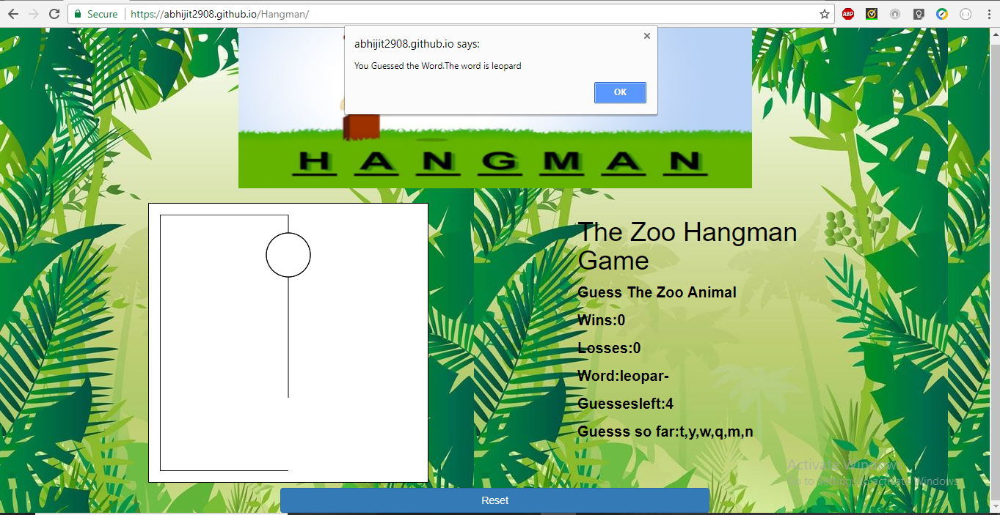
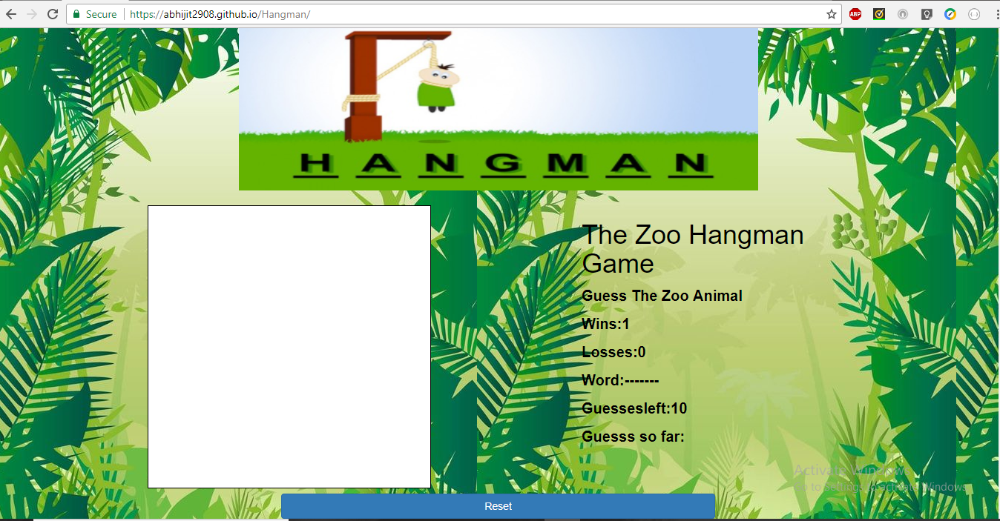
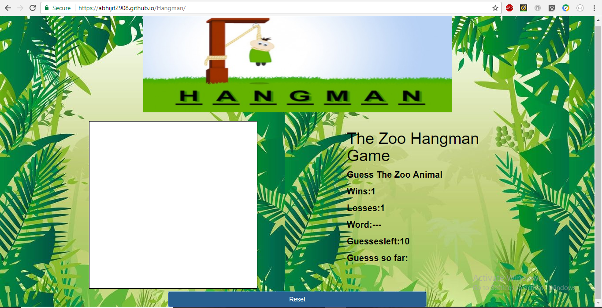
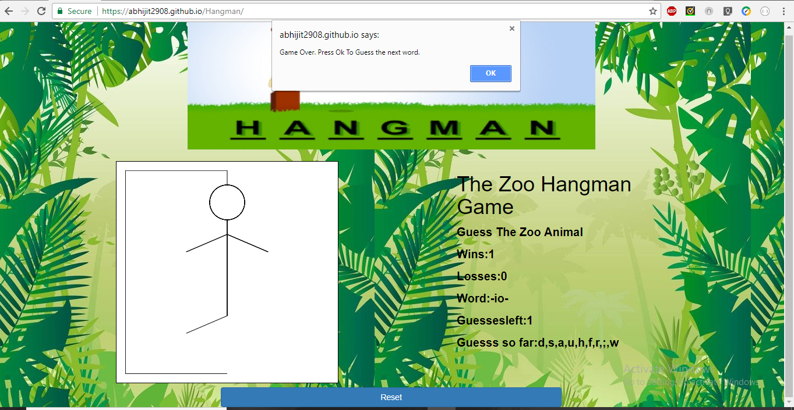
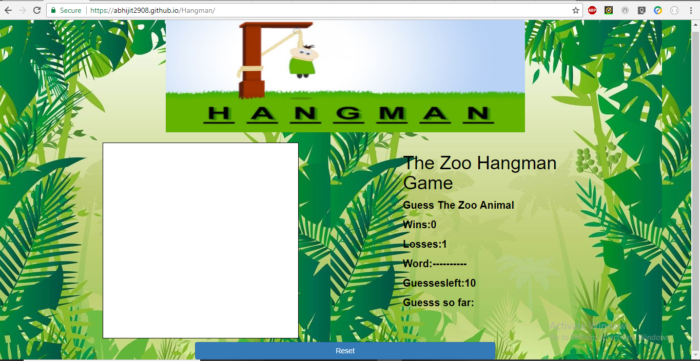

# Hangman

Hangman is programmed using HTML/CSS and javascript.

It is a fun game which asks user to guess animal names.

 * The User arrives at the following page: https://abhijit2908.github.io/Hangman/

 

 * The User starts guessing 

 

 * If the user is successful he gets a message

 

 * His wins increase and Game resets

 

 * If user wants to reset he can click on reset button

 

 

 * If user cannot guess the word with the guesses allowed, user loses the game and a new word is given to him to guess

 

## Enjoy the Game!!